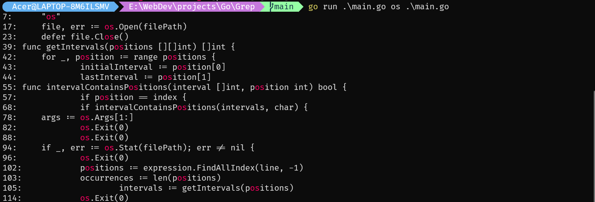

## Grepper in Golang

This is a grepper in Golang. You give it a file path and a text to search for and it will find out the relevant results.

## Command to run the code

```
go run main.go [text] [file]
```

## Results

